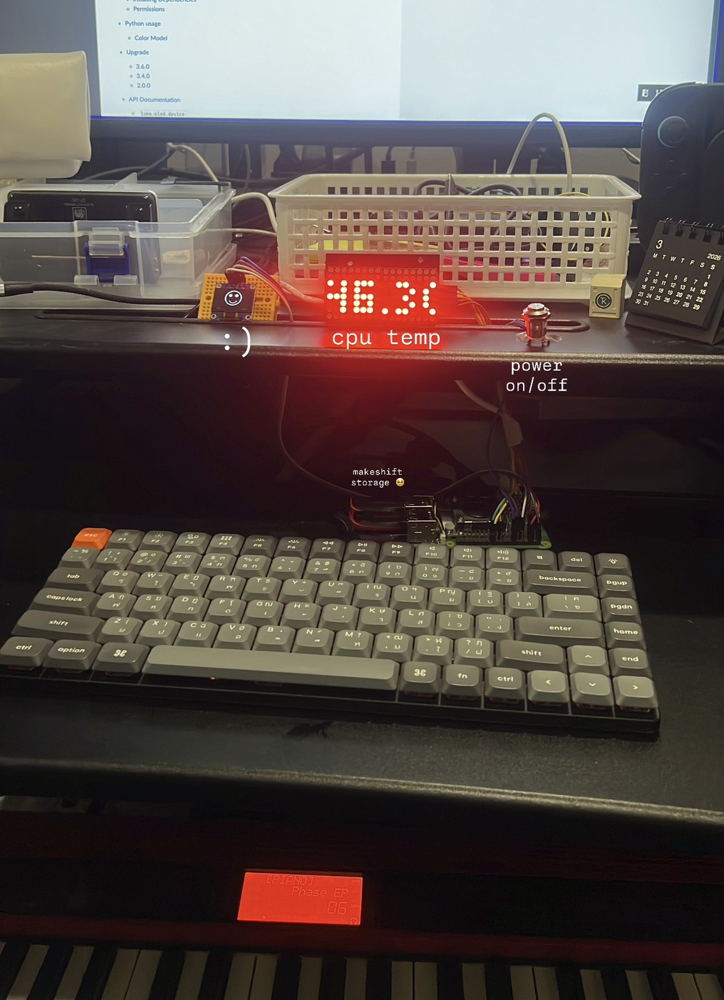

# Thee's Mini Home Displays

Code used to power my small displays at home

<div style="display: grid; grid-template-columns: 1fr 1fr; gap: 20px;">
  <div>
    
  </div>
  <div>
    
  </div>
</div>

## Hardware

- Raspberry Pi
- 2× MAX7219 8×8 LED Matrix modules (daisy-chained) (SPI)
- SSD1306 0.96 inch OLED display (I2C)
- Jumper wires

The two LED panels are connected in series, so the Raspberry Pi only connects to the first module.

---

## Pin Layout

| MAX7219 Pin   | Raspberry Pi Pin | GPIO          |
| ------------- | ---------------- | ------------- |
| VCC           | Pin 2 / 4        | 5V            |
| GND           | Pin 6            | GND           |
| DIN (Data In) | Pin 19           | GPIO10 (MOSI) |
| CLK (Clock)   | Pin 23           | GPIO11 (SCLK) |
| CS (Load)     | Pin 24           | GPIO8 (CE0)   |

---

## SPI Interface

The display uses SPI0 on the Raspberry Pi.

```
MOSI → GPIO10 (Pin 19)
SCLK → GPIO11 (Pin 23)
CE0  → GPIO8  (Pin 24)
```

Enable SPI:

```
sudo raspi-config
Interface Options → SPI → Enable
```

---

## Panel Chain

```
Raspberry Pi
     │
     ▼
[MAX7219 Panel 1] ──► [MAX7219 Panel 2]

Panel 1 DIN  ← Raspberry Pi MOSI
Panel 1 DOUT → Panel 2 DIN
```

Only the first module connects to the Pi.  
The second module receives data from the first via `DOUT → DIN`.

---

## Python Library

Common library used:

```
luma.led_matrix
```

Example configuration:

```python
device = max7219(serial, cascaded=2)
```

`cascaded=2` indicates **two matrices connected in series**.

---

## Wiring Diagram

```
Raspberry Pi        MAX7219
-----------         -------
5V  (Pin 2)   --->  VCC
GND (Pin 6)   --->  GND
GPIO10 (19)   --->  DIN
GPIO11 (23)   --->  CLK
GPIO8  (24)   --->  CS
```

## Setup

This project is powered by a raspberry pi, using python to drive the gpio, spi, and i2c interfaces.

Note: enable I2C SPI interface enabled on the Raspberry Pi

```bash
sudo raspi-config
Interface Options → I2C → Enable
Interface Options → SPI → Enable
```

Install the system-wide packages.

```bash
sudo apt update
sudo apt install -y swig python3-dev python3-lgpio
```

Setup python venv.

```bash
python3 -m venv venv --system-site-packages
source venv/bin/activate
```

Then, install dependencies.

```bash
pip install gpiozero luma.oled luma.led_matrix pillow
```

After this, you are good to run the code. You can run the main display loop with:

```bash
python main.py
```

### Bonus: Set up daemon

To have the display loop start on boot, you can set up a systemd service. Create a file at `/etc/systemd/system/display.service` with the following contents:

```bash
nano /etc/systemd/system/display.service`
```

```ini
[Unit]
Description=Mini Home Display Service
After=network.target

[Service]
User=<your-username>
WorkingDirectory=/home/<your-username>/code/display
ExecStart=/home/<your-username>/code/display/venv/bin/python /home/<your-username>/code/display/main.py # replace with the actual path to your main.py
Restart=always
RestartSec=3

[Install]
WantedBy=multi-user.target
```

then enable and start the service:

```bash
sudo systemctl enable display.service
sudo systemctl start display.service
```

---

## Credits

- **Bad Apple!!** — original animation by [Alstroemeria Records](https://www.nicovideo.jp/watch/sm8628149). Frames sourced from the [Internet Archive image sequence](https://archive.org/details/bad_apple_is.7z).
